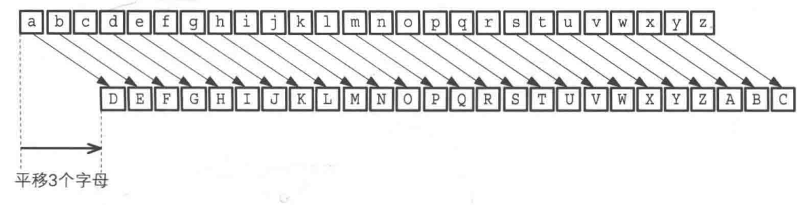
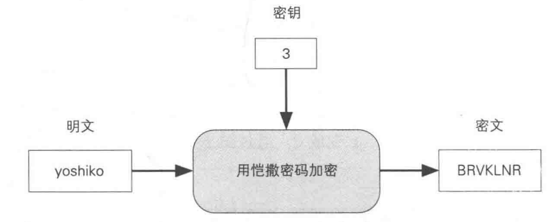
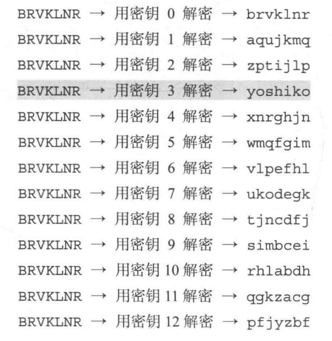
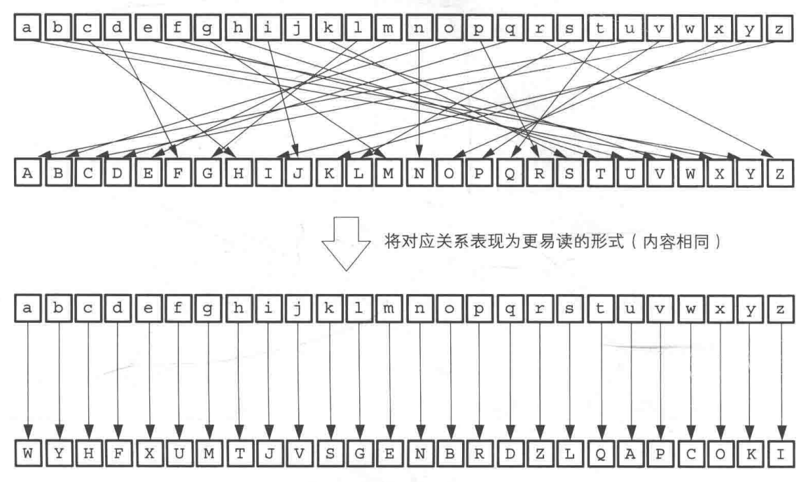
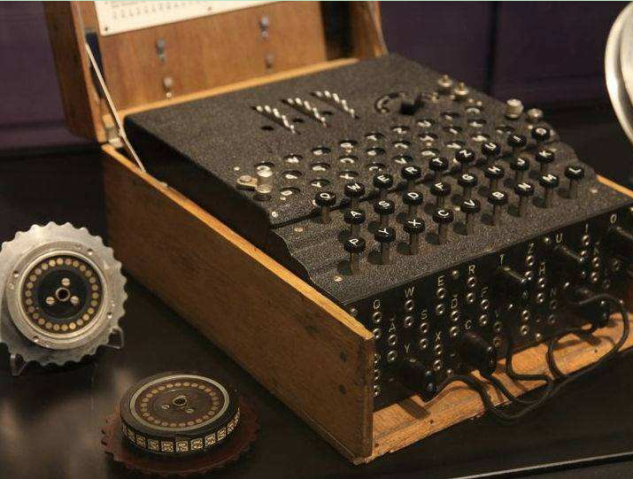
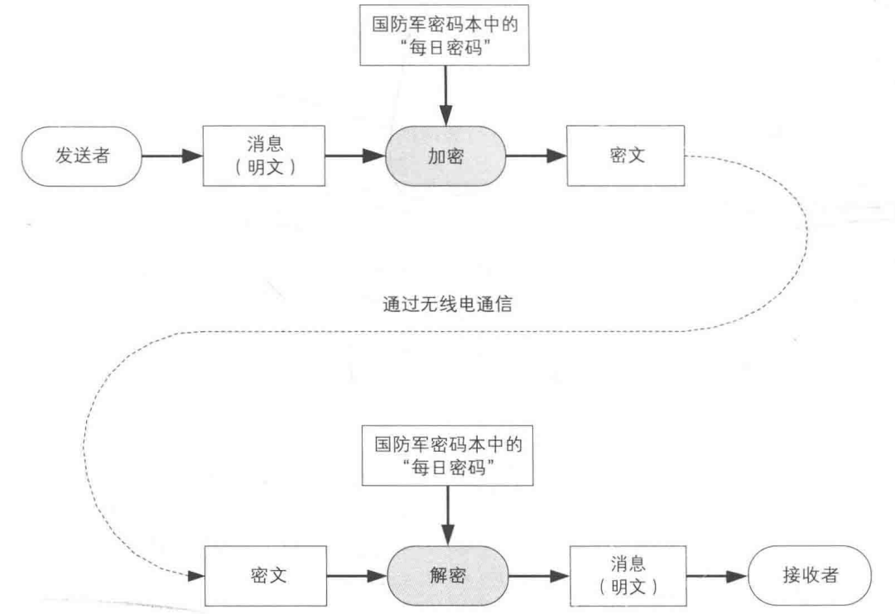
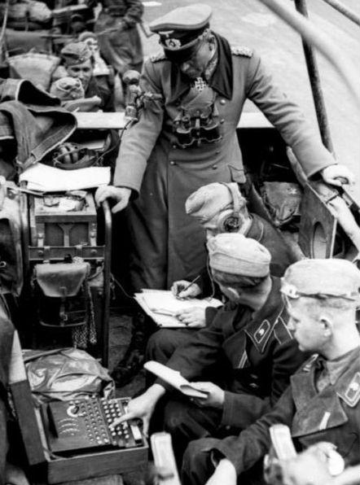
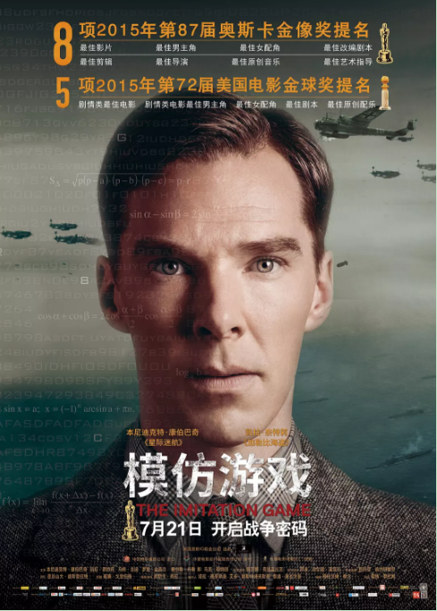

# 密码历史

### 古典密码

##### 凯撒密码

- 诞生于公元前100年左右
- 古罗马
- 平移

###### 算法

###### 加密

###### 破解

##### 简单替换密码

###### 算法

​	凯撒密码的升级版，将平移替换为无序对应。

###### 破解

- 暴力破解：每秒计算10亿次，需要计算60亿年。
  $$
  26! ≈ 4.03 * 10^{26}
  $$

- 频率分析：统计每个字母出现的频率，和英文中词语使用频率对应，就能破解。

##### 弱点

- 相同明文加密后为相同密文

### 近现代密码

##### 时间

- 第一次世界大战、第二次世界大战到1976

##### Enigma

二战中，德国用来发送消息的密码装置。

###### 加解密

###### 优点

同一个字母，加密后可以是不同字母。

###### 缺点

- 密钥需要加密两次：因为信号不好，但同时也提供了破解线索
- 密码本的配送：密钥配送问题
- 同一字母加密后不会是该字母本身

###### 历史人物

希特勒（1889.4.20-1945.4.30）：有统一世界的强大野心

图灵（1912.6.23—1954.6.7）：enigma破译者(1940年)

丘吉尔（1874.11.30-1965.1.24）：英国命运的主宰者

### 现代密码

现在我们所使用的密码。

