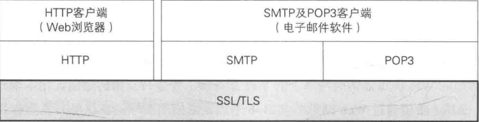
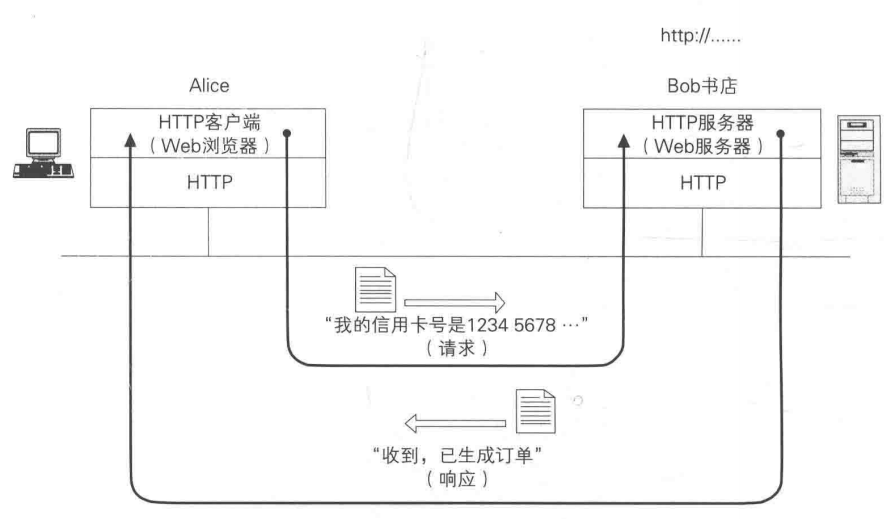
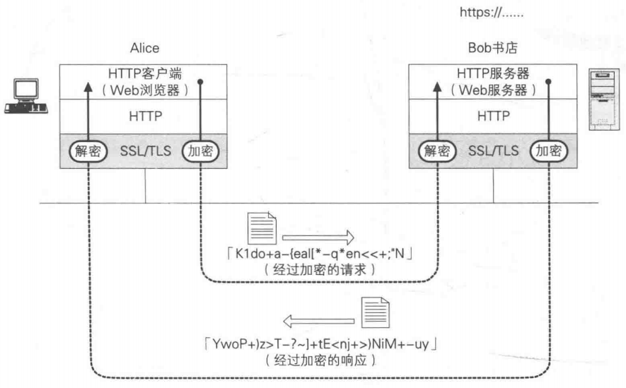

# 概述

### 什么是SSL/TLS

##### SSL

- SSL（Secure Socket Layer）安全套接字层
- 1994年发布
- 1995年发布SSL3.0
- 2014年SSL3.0发现POODLE
- 已经不安全

##### TLS

- TLS（Transport Layer Security）传输层安全

- TLS是SSL的升级版
- 1999年TLS1.0，等于SSH3.1
- 2006年TLS1.1
- 2008年TLS1.2
- 2018年TLS1.3

​     TLS用于在两个通信应用程序之间提供保密性和数据完整性。该协议由两层组成： TLS 记录协议（TLS Record）和 TLS握手协议（TLS Handshake）

### HTTP

### HTTPS

