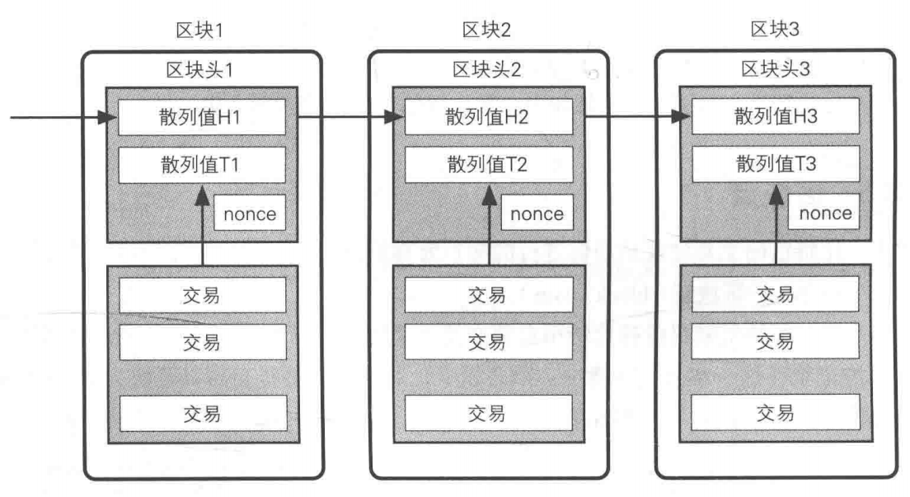

# 比特币

- 虚拟货币

- 2009年由中本聪发布
- 区块链之父


### 诞生

##### 去中心化

- 通货膨胀，银行增钞（不靠谱）
- 不能由一个中心决定价值
- 可由每个人监督（分布式账本）
- 每一笔交易都可追溯
- 每一笔交易都公开
- 每一笔交易都不可篡改
- 解决信任问题

### 账本（区块链）

- 篡改非常困难



```java
当前区块哈希 = Hash(交易内容 + 前一区块哈希 + 当前区块高度 + 时间戳 + Nonce)；
挖矿难度 = 哈希的前4位数为0；

if ( 当前区块哈希 == 挖矿难度 ){
    Nonce 有效；
    当前区块哈希 有效；
}
```

### 加密算法

- RIPEMD-160：单向散列函数
- DSA：椭圆曲线