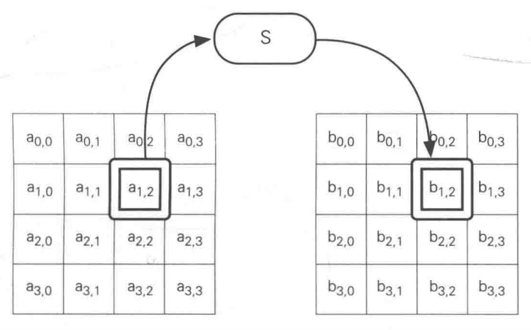
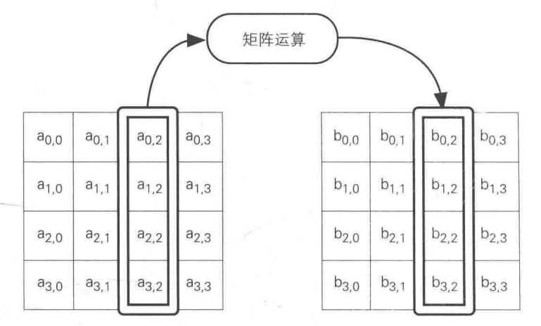
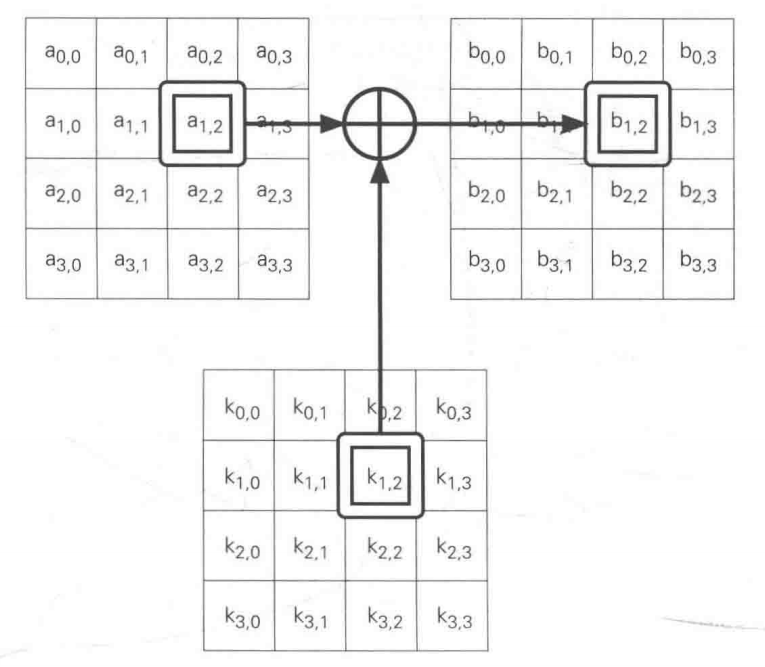

# AES

### 什么是AES？

- （Advanced Encryption Standard）高级加密标准
- 2000年诞生
- 三年公开选拔

### Rigndael

​	AES标准密码算法

##### 算法过程

###### SubBytes

128为，16字节，0~255，Substitute-Box

​										   简单密码替换



###### ShiftRows

​										  根据规则平移


###### MixColumns



###### AddRoundmKey



##### 算法过程动态展示

```http
http://www.formaestudio.com/rijndaelinspector/archivos/Rijndael_Animation_v4_eng.swf
```

##### 优点

- 速度快
- 暂无有效攻击

#### 疑问

###### 能推导出密钥吗？

提示：不能，密钥进过扩展，并存在多重异或。