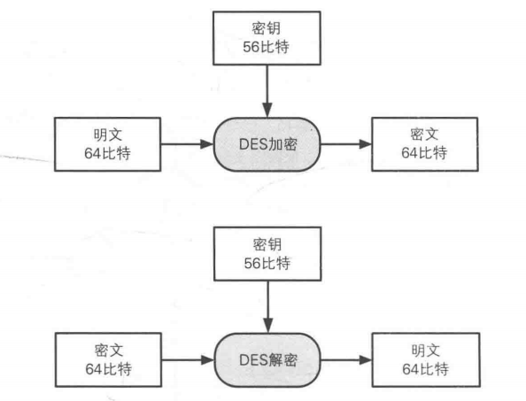
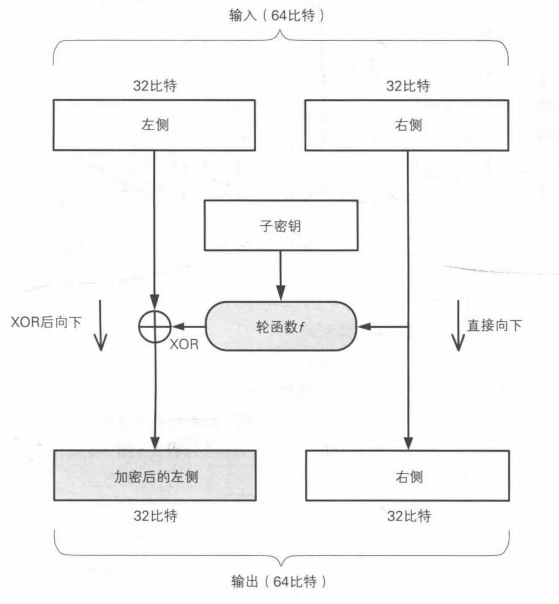

# DES

### 什么是DES？

- （Data Encryption Standard）1977年被美国采用的一种密码。
- 已经不安全。
- 1999年的公开破解中用了22小时。

### 加解密

- 每次只对64比特进行加解密。
- 原文需要分组。
- 密钥每7比特有一个校验位，所以实际有56比特。

### Feistel网络

##### 一层加解密

##### 疑问？

###### 1、为什么使用轮函数f？而不直接XOR！

- 不使用轮函数就没有机密性可言，就能直接还原了！
- 通过原文和密文即可算出密钥。

###### 2、为什么使用两部分处理?

- 解密需要依靠右半部分，增加了安全性。

### 攻击

##### 差分分析

- 改变一部分明文，分析密文怎么改变。

##### 线性分析

- 找到明文和密文XOR后为0的概率，如果偏离1/2，则会提供一些和密钥相关的线索。