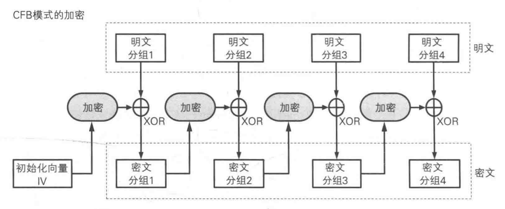
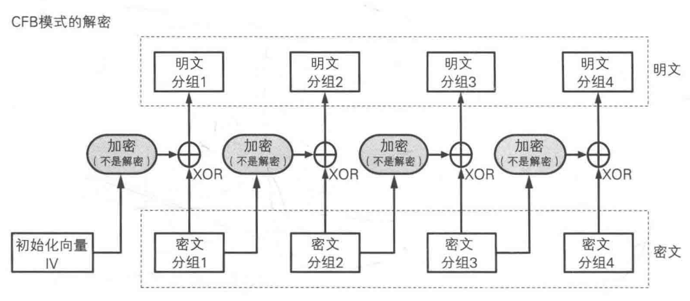
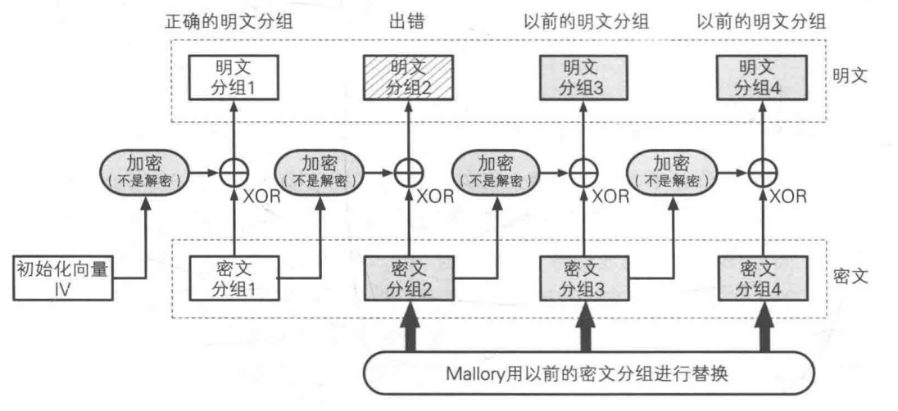

# CFB

- （Cipher Feedback）密文反馈模式
- 前一个密文作为加密输入

### 算法

##### 加密

​	明文和上一次输出密文进行加密后，再XOR

##### 解密

### 疑问

##### 为什么解密使用的是加密？

- 保证能算出明文
- 只使用加密，增强了密钥的安全，可以使用不可逆函数

### 攻击

##### 重放攻击

- 用以前的数据再次发送，还能生效

