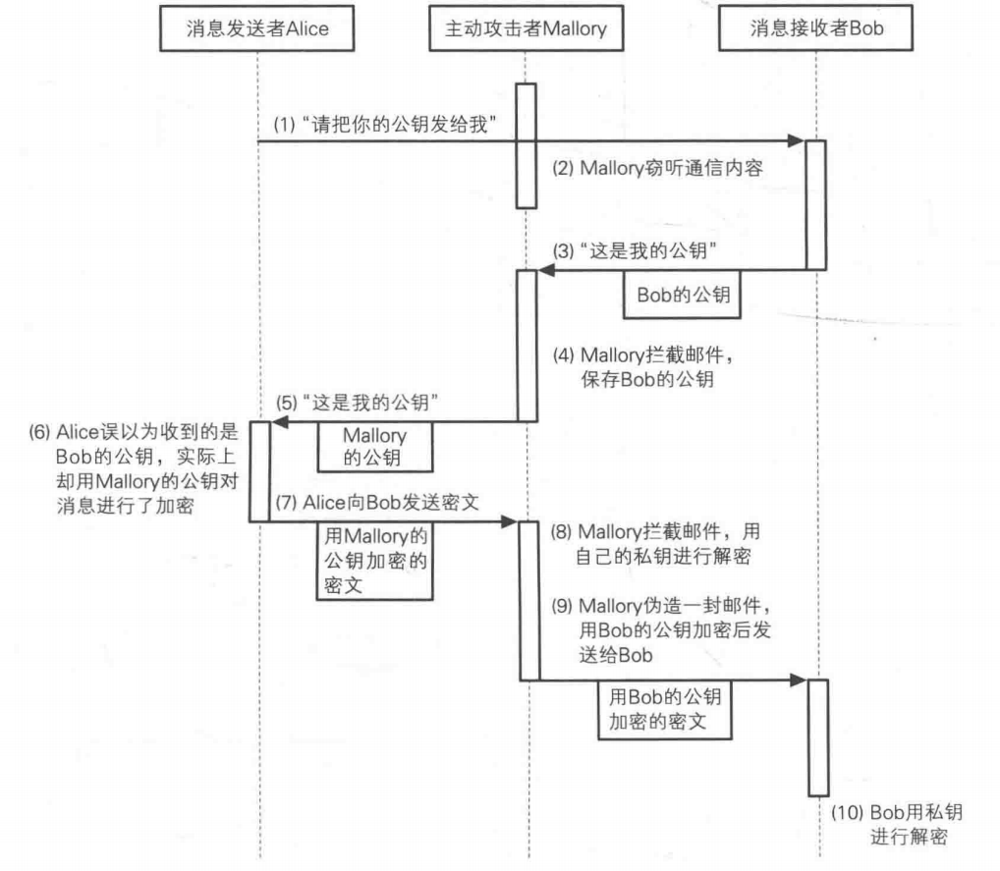

# 攻击

### 通过密文找明文

已知密文、E、N，求明文：
$$
明文^{E} mod N=?^{5}mod323=225
$$

- 目前没有找到高效算法

### 暴力破解私钥D

$$
密文^{D}modN=225^{?}mod323=123
$$

- D的长度约等于N的长度，当D为2048位时，暴力破解几乎不现实

### 通过E、N求解D

由公式：
$$
E * D ≡ 1(mod L)
$$
可知：

要求解D，必须知道L，而L由公式：
$$
L=lcm(p-1,q-1)
$$
可知：

要知道L，必须求解p、q

而又由公式：
$$
p * q = N
$$
可知：

p、q可以N质数分解得出，但是：

- 目前还没有高效的质因数分解算法

### 中间人攻击

### 选择密文攻击

- 通过解密提示，获取明文信息
