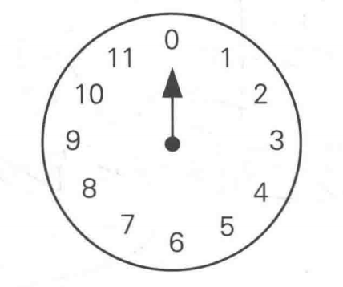
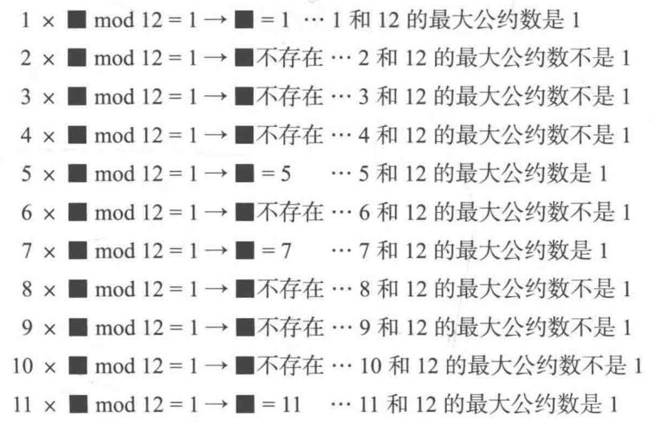

# 时钟运算

- 在只有一个指针的时钟上运行的运算

### 基本运算

##### 加法

- 12 + 3 = ？
- 12 + 3 = 3

###### 其实是取模（mod）运算

- 12 + 3  ≡ 3 （mod 12） 
- （12 + 3）mod 12 = 3

##### 减法

###### 与加法类似

- 18 - 3 ≡ 3 （mod 12）

##### 乘法

###### 作累加运算

- 7 + 7 + 7 + 7 ≡ 4 （mod 12） 

##### 除法

###### 乘法的逆运算

- 7 * 7 ≡  1 （mod12）
- 1 （mod 12）÷  ？ = 7

#####  乘方

###### 累乘运算

$$
7 ^{4} ≡ 1 (mod12)
$$

### 引申出来的理论

- 什么情况下，两个数的乘积与1在模n时同余？

$$
a * b ≡ 1 (modn)
$$

##### 例子

##### 最大公约数

- 指两个或多个整数共有约数中最大的一个

##### 质数

- 在大于1的自然数中，除了1和它本身以外不再有其他因数

##### 互质

- 公约数只有1的两个整数

##### 离散对数

###### 乘方的逆运算
$$
7 ^{?} ≡ 1 (mod12)
$$

###### 性质

- 求解对数容易，但是求解离散对数非常困难，快速求解算法目前还没有发现