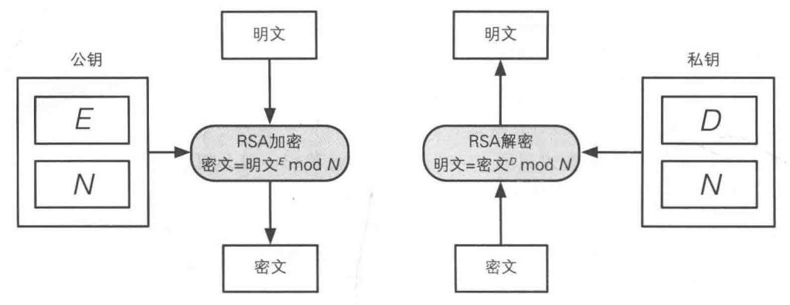
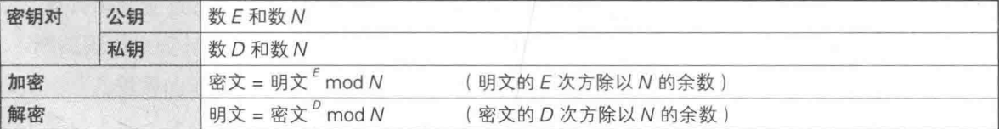
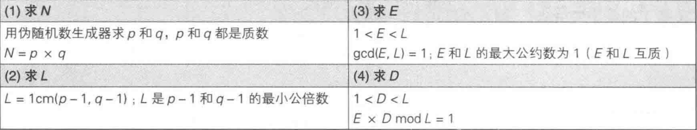
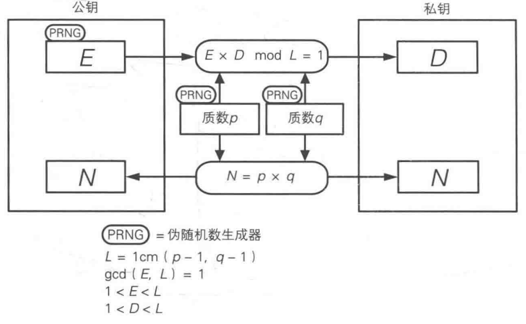

# 加解密过程

- 乘方

### 过程

##### 加解密

##### 求解过程

- 求N
- 求L（过程中使用的数）
- 求E
- 求D

##### 对应关系

### 实例

##### 求N

p = 17 , q = 19（两个质数）

N = p  x q（求积）

​    = 17 x 19

​    = 323

##### 求L

L = lcm(p-1, q-1) （求p-1、q-1的最小公倍数）

   = lcm(16, 18)

   = 144 

##### 求E

1 ~ 144 的质数较多，有：

5、7、11、13、17、19、23、25、29、31 ...

取E = 5

##### 求D

E x D ≡ 1（mod L）

5 x D ≡ 1（mod 144）

D = 29

##### 结果

###### 公钥

E = 5 ， N = 323

###### 私钥

D = 29，N = 323

##### 加密

$$
明文^{E} mod N=123^{5}mod323=225
$$

##### 解密

$$
密文^{D}modN=225^{29}mod323=123
$$