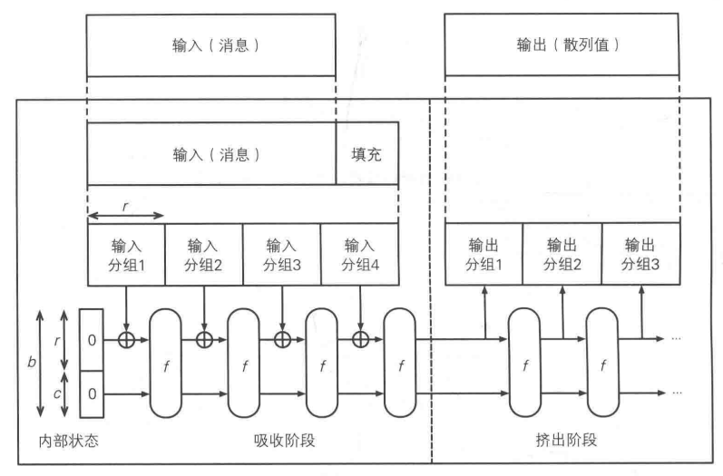
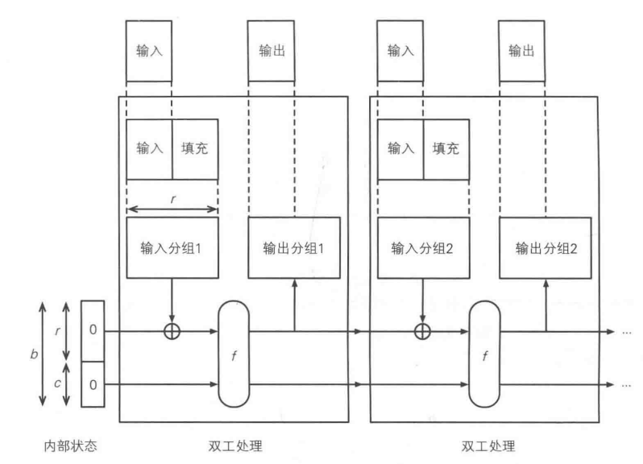
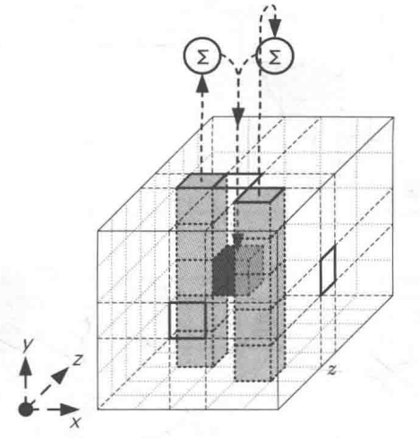
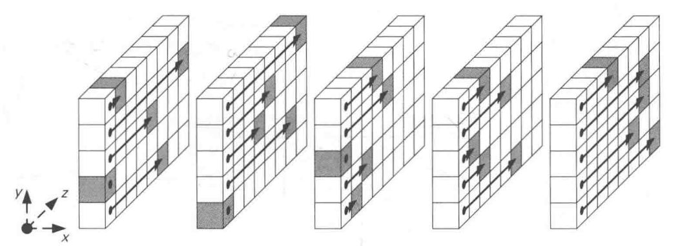
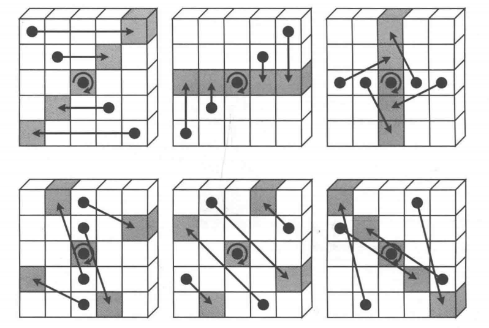

# keccak

- SHA3标准算法
- SHA3-224
- SHA3-256
- SHA3-384
- SHA3-512

### 海绵结构

### 双工结构

### f函数内部构造

##### θ（西塔）

- 异或

##### ρ（柔）

- 平移

##### π（派）

- 移动

##### χ（凯）

- AND
- XOR
- NOT

##### τ（伊欧塔）

- 和常数进行XOR

### 疑问

##### C的存在意义

- 防止输入数据的敏感性：防止每轮输入F的操控

##### 能够逆向还原吗

- 多个异或
- AND
- 不存在反函数